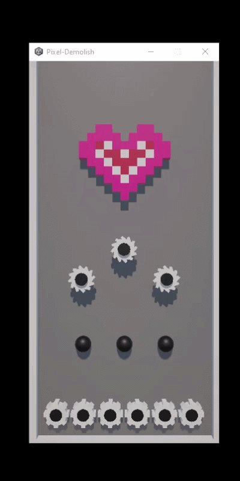

## Pixel Demolish 🎮
## Download 🛠️: https://drive.google.com/drive/u/0/folders/1lEsH9afIDLiP6pJntsuqANrjnC0vUgHT

Pixel Demolish is a simple arcade-style game where players destroy voxel-based structures by clicking directly on them.
Each click detaches cubes from the main entity, triggering physics-based interactions as pieces break apart and fall.
The game focuses on satisfying destruction mechanics combined with continuous spawning, creating a dynamic and increasingly challenging gameplay loop.


## 🎬 Demo




## 🚀 Gameplay

- **Player**
  - Click on cubes to destroy them
  - Area-based destruction (circular radius)
  - Detached cubes fall using physics (Rigidbody)
  - Entities continuously spawn from above


## 🎯 Objective

- Destroy as many cubes as possible.
- Manage the space before it gets 'overwhelmed' by falling blocks.


## 🛠️ Tech Stack

- **Engine**: Unity 6
- **Engine**: C# (.NET)


## 📦 Setup & Run
```bash

# 1) Download and Extract
Download https://drive.google.com/drive/u/0/folders/1lEsH9afIDLiP6pJntsuqANrjnC0vUgHT

# 2) Play game
Run file: Pixel-Demolish.exe

```


<div class="container">
    <hr class="my-4 border-secondary">
    <div class="row justify-content-center">
        <div class="col-12 text-center">
            <p class="mb-2 text-muted">
                <i class="fas fa-code me-2"></i>
                Developed by <strong style="color: pink;">Phạm Quốc Tuấn ❤️</strong>
            </p>
            <p class="mb-2 text-muted">
                <i class="fas fa-code me-2"></i>
                IT - Saigon University
            </p>
            <p class="mb-4 text-muted">
                &copy; 2026 Pixel Demolish. All rights reserved.
            </p>
        </div>
    </div>
</div>